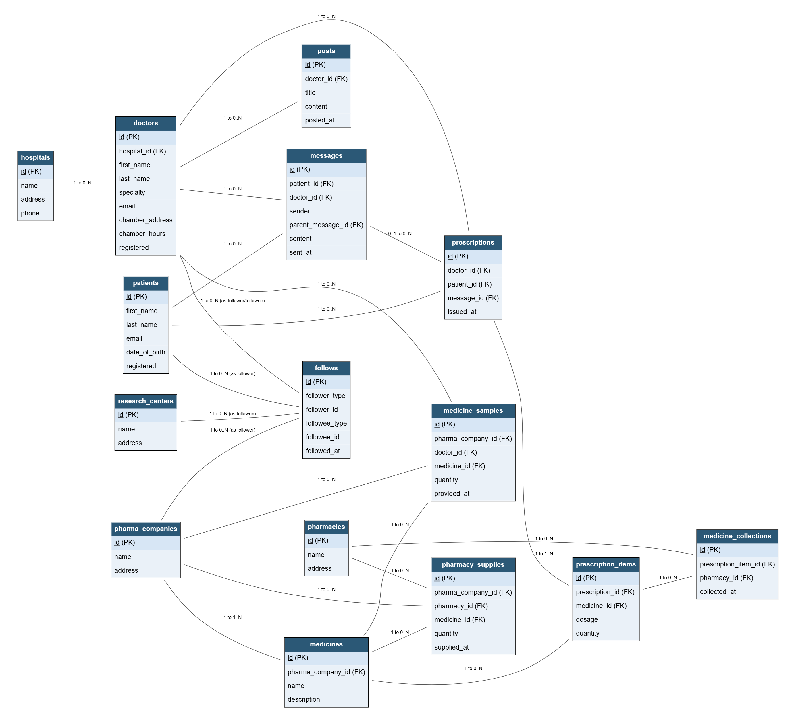

# Design Document

By [Mirza Naeem Beg](https://mirzanaeembeg.github.io/)

Video overview: <https://youtu.be/1pEdIomV4AY>

## Scope

This database supports a healthcare network of patients, doctors, hospitals, pharmacies, pharmaceutical companies, and medical research centers. It is intended to make medical advice easier for patients to access while helping the people who prescribe and supply medicines work together. The database covers:

* Patients, including basic identifying information
* Doctors, including their specialty, chamber (clinic) details, and hospital affiliation
* Hospitals, pharmacies, pharmaceutical companies, and research centers, including basic identifying information
* Follow connections between any two users in the network (e.g. a patient following a doctor, or a doctor following a research center), so the network can represent both direct and indirect relationships
* Messages exchanged between a patient and a doctor, such as a patient's question and a doctor's reply
* Posts made by doctors, such as specialty tips and advice for patients
* Prescriptions written by doctors for patients, and the individual medicines within each prescription
* Free medicine samples pharmaceutical companies give to doctors
* Bulk medicine supply from pharmaceutical companies to pharmacies
* Patients collecting prescribed medicine from a pharmacy

Out of scope are elements like payments and billing, insurance claims, appointment scheduling and calendars, video/voice consultations, and content moderation, none of which are core to the first version of this app.

## Functional Requirements

The database supports:

* CRUD operations for patients, doctors, hospitals, pharmacies, pharmaceutical companies, and research centers
* Any user in the network following any other user, directly or indirectly, so the network can grow organically
* A patient messaging a doctor and the doctor replying, with support for threaded follow-up messages
* A doctor posting specialty-specific tips and advice, and updating their chamber details
* A doctor writing a prescription containing one or more medicines for a patient
* A pharmaceutical company giving medicine samples to doctors and supplying medicine in bulk to pharmacies
* A patient collecting their prescribed medicine from a pharmacy against a valid prescription

Note that in this iteration, the system will not support real-time chat delivery, payment processing, or verifying a pharmacy's physical medicine stock beyond what has been recorded as supplied to it.

## Representation

Entities are captured in SQLite tables with the following schema.

### Entities

The database includes the following entities:

#### Hospitals

The `hospitals` table stores:

* `id`, the hospital's `INTEGER` primary key.
* `name`, the hospital's name as `TEXT`.
* `address`, the hospital's address as `TEXT`.
* `phone`, an optional `TEXT` contact number. It is stored as text because phone numbers may contain formatting characters.

 `id`, the message's `INTEGER` primary key.

The `research_centers` table includes:

* `id`, an `INTEGER` and `PRIMARY KEY`.
* `name`, the research center's name as `TEXT`.
* `address`, the research center's address as `TEXT`.

#### Pharmaceutical Companies

The `pharma_companies` table includes:

* `id`, an `INTEGER` and `PRIMARY KEY`.
* `name`, the company's name as `TEXT`.
* `address`, the company's address as `TEXT`.

#### Pharmacies

The `pharmacies` table includes:

* `id`, an `INTEGER` and `PRIMARY KEY`.
* `name`, the pharmacy's name as `TEXT`.
* `address`, the pharmacy's address as `TEXT`.

All columns in `hospitals`, `research_centers`, `pharma_companies`, and `pharmacies` (aside from optional `phone`) have the `NOT NULL` constraint applied, since each is required to meaningfully identify the entity.

#### Doctors

The `doctors` table includes:

* `id`, an `INTEGER` and `PRIMARY KEY`.
* `hospital_id`, the `INTEGER` ID of the hospital the doctor is primarily affiliated with. This column has the `FOREIGN KEY` constraint applied, referencing the `id` column in the `hospitals` table. It is nullable, since not every doctor need be tied to a hospital.
* `first_name` and `last_name`, the doctor's name as `TEXT`.
* `specialty`, the doctor's medical specialty (e.g. "Cardiology") as `TEXT`.
* `email`, the doctor's email as `TEXT`, with a `UNIQUE` constraint so no two doctors share an account.
* `chamber_address` and `chamber_hours`, describing where and when the doctor sees patients in person, both `TEXT` and nullable, since a doctor may not yet have posted chamber details.
* `registered`, a `NUMERIC` timestamp (per SQLite's recommended representation for dates and times) defaulting to `CURRENT_TIMESTAMP`.

#### Patients

The `patients` table includes:

* `id`, an `INTEGER` and `PRIMARY KEY`.
* `first_name` and `last_name`, the patient's name as `TEXT`.
* `email`, the patient's email as `TEXT`, with a `UNIQUE` constraint.
* `date_of_birth`, stored as `NUMERIC`, consistent with SQLite's date/time storage recommendation. Nullable, since a patient may not provide it at signup.
* `registered`, a `NUMERIC` timestamp defaulting to `CURRENT_TIMESTAMP`.

#### Medicines

The `medicines` table includes:

* `id`, an `INTEGER` and `PRIMARY KEY`.
* `pharma_company_id`, the `INTEGER` ID of the manufacturing company, with a `FOREIGN KEY` constraint referencing `pharma_companies(id)`.
* `name`, the medicine's name as `TEXT`.
* `description`, an optional `TEXT` field for composition or notes.

A `UNIQUE` constraint on (`pharma_company_id`, `name`) ensures a company does not have two identically named medicines on record.

#### Follows

The `follows` table represents a connection where one user in the network follows another, capturing the app's requirement that "all users will be connected with each other directly or indirectly." Because a follow can occur between any two of the six user types (patient, doctor, hospital, pharmacy, pharma company, research center), this table is polymorphic rather than tied to a single pair of tables:

* `id`, an `INTEGER` and `PRIMARY KEY`.
* `follower_type`, `TEXT`, constrained via `CHECK` to one of the six entity type names, identifying which table `follower_id` refers to.
* `follower_id`, the `INTEGER` ID of the following user within that table.
* `followee_type` and `followee_id`, the same pairing for the user being followed.
* `followed_at`, a `NUMERIC` timestamp defaulting to `CURRENT_TIMESTAMP`.

A `UNIQUE` constraint across all four of `follower_type`, `follower_id`, `followee_type`, `followee_id` prevents duplicate follows. Note that SQLite cannot enforce a `FOREIGN KEY` against a table chosen dynamically by another column's value, so referential integrity for `follower_id`/`followee_id` against the correct table is enforced by the application, not the database engine; this trade-off is discussed further under Limitations.

#### Messages

The `messages` table includes:

* `id`, an `INTEGER` and `PRIMARY KEY`.
* `patient_id` and `doctor_id`, `INTEGER` foreign keys referencing `patients(id)` and `doctors(id)`, identifying the two participants in the conversation.
* `sender`, `TEXT` constrained via `CHECK` to either `'patient'` or `'doctor'`, indicating who sent this particular message.
* `parent_message_id`, an `INTEGER` foreign key referencing `messages(id)`, used to thread a reply to an earlier message in the same conversation. Nullable, since the first message in a thread has no parent.
* `content`, the message body as `TEXT`.
* `sent_at`, a `NUMERIC` timestamp defaulting to `CURRENT_TIMESTAMP`.

#### Posts

The `posts` table includes:

* `id`, an `INTEGER` and `PRIMARY KEY`.
* `doctor_id`, an `INTEGER` foreign key referencing `doctors(id)`.
* `title` and `content`, `TEXT` fields for the post's heading and body.
* `posted_at`, a `NUMERIC` timestamp defaulting to `CURRENT_TIMESTAMP`.

#### Prescriptions

The `prescriptions` table includes:

* `id`, an `INTEGER` and `PRIMARY KEY`.
* `doctor_id` and `patient_id`, `INTEGER` foreign keys referencing `doctors(id)` and `patients(id)`.
* `message_id`, an `INTEGER` foreign key referencing `messages(id)`, letting a prescription be traced back to the consultation that prompted it. Nullable, since a prescription can also follow an in-person chamber visit with no associated message.
* `issued_at`, a `NUMERIC` timestamp defaulting to `CURRENT_TIMESTAMP`.

#### Prescription Items

Because one prescription can include multiple medicines, each with its own dosage, a separate `prescription_items` table avoids repeating prescription data per medicine. It includes:

* `id`, an `INTEGER` and `PRIMARY KEY`.
* `prescription_id`, an `INTEGER` foreign key referencing `prescriptions(id)`.
* `medicine_id`, an `INTEGER` foreign key referencing `medicines(id)`.
* `dosage`, `TEXT` describing how the medicine should be taken (e.g. "1 tablet twice daily").
* `quantity`, an `INTEGER` with a `CHECK` constraint requiring it be greater than 0.

#### Medicine Samples

The `medicine_samples` table records a pharmaceutical company giving a doctor free samples to prescribe to patients. It includes:

* `id`, an `INTEGER` and `PRIMARY KEY`.
* `pharma_company_id`, `doctor_id`, and `medicine_id`, `INTEGER` foreign keys referencing `pharma_companies(id)`, `doctors(id)`, and `medicines(id)` respectively.
* `quantity`, an `INTEGER` with a `CHECK` constraint requiring it be greater than 0.
* `provided_at`, a `NUMERIC` timestamp defaulting to `CURRENT_TIMESTAMP`.

#### Pharmacy Supplies

The `pharmacy_supplies` table records a pharmaceutical company's bulk supply of medicine to a pharmacy. It includes:

* `id`, an `INTEGER` and `PRIMARY KEY`.
* `pharma_company_id`, `pharmacy_id`, and `medicine_id`, `INTEGER` foreign keys referencing `pharma_companies(id)`, `pharmacies(id)`, and `medicines(id)`.
* `quantity`, an `INTEGER` with a `CHECK` constraint requiring it be greater than 0.
* `supplied_at`, a `NUMERIC` timestamp defaulting to `CURRENT_TIMESTAMP`.

#### Medicine Collections

The `medicine_collections` table records a patient collecting a specific prescribed medicine item from a pharmacy, tying the pharmacy back to a valid prescription. It includes:

* `id`, an `INTEGER` and `PRIMARY KEY`.
* `prescription_item_id`, an `INTEGER` foreign key referencing `prescription_items(id)`, ensuring the collected medicine traces back to a doctor's valid prescription.
* `pharmacy_id`, an `INTEGER` foreign key referencing `pharmacies(id)`.
* `collected_at`, a `NUMERIC` timestamp defaulting to `CURRENT_TIMESTAMP`.

All foreign key and primary key columns above are implicitly required; all other columns have the `NOT NULL` constraint applied except where noted as optional.

### Relationships

The below entity relationship diagram describes the relationships among the entities in the database.

As detailed by the diagram:

* One hospital is affiliated with 0 to many doctors; a doctor is affiliated with 0 or 1 hospitals.
* One pharmaceutical company manufactures 1 to many medicines; a medicine is manufactured by one and only one pharmaceutical company.
* Any user (patient, doctor, hospital, pharmacy, pharma company, or research center) can appear 0 to many times as a follower and 0 to many times as a followee in `follows`, capturing direct connections such as a patient following a doctor, a doctor following a research center, or a pharmaceutical company following a doctor.
* One patient can exchange 0 to many messages with a doctor, and one doctor can exchange 0 to many messages with a patient; a message belongs to one and only one patient-doctor pair. A message may optionally have one parent message, forming a reply thread.
* One doctor can write 0 to many posts; a post belongs to one and only one doctor.
* One doctor can write 0 to many prescriptions, and one patient can receive 0 to many prescriptions; a prescription belongs to one and only one doctor and one and only one patient, and optionally references the one message that prompted it.
* One prescription contains 1 to many prescription items; a prescription item belongs to one and only one prescription. One medicine can appear on 0 to many prescription items.
* One pharmaceutical company can give 0 to many medicine samples to doctors, and one doctor can receive 0 to many medicine samples; each medicine sample record involves one company, one doctor, and one medicine.
* One pharmaceutical company can supply 0 to many medicine batches to pharmacies, and one pharmacy can receive 0 to many supplies; each supply record involves one company, one pharmacy, and one medicine.
* One prescription item can be collected 0 to many times (allowing partial or repeat collection), and one pharmacy fulfills 0 to many collections; each collection belongs to one and only one prescription item and one and only one pharmacy.

## Optimizations

Per the typical queries in `queries.sql`, it is common for users of the app to look up a doctor or patient by name, so indexes are created on the `first_name`/`last_name` columns of both the `doctors` and `patients` tables. Doctors are also commonly filtered by `specialty` (e.g. "find all cardiologists"), so an index is created on that column too.

Since finding a specific medicine by name is a frequent lookup for prescriptions, samples, and supply records alike, an index is created on the `name` column of `medicines`.

Because `follows` is queried in both directions (finding everyone a user follows, and finding everyone who follows a user), indexes are created on (`follower_type`, `follower_id`) and (`followee_type`, `followee_id`) to speed both lookups.

An index is created on (`patient_id`, `doctor_id`) in `messages` to speed retrieval of a full conversation thread between one patient and one doctor, and an index is created on `patient_id` in `prescriptions` to speed retrieval of a patient's prescription history.

## Limitations

The `follows` table's polymorphic design lets any user type follow any other, matching the app's requirement that all users be connected directly or indirectly, but SQLite cannot enforce a `FOREIGN KEY` constraint against a table selected dynamically by a `*_type` column. This means referential integrity of `follower_id`/`followee_id` (i.e. making sure the ID actually exists in the table its `_type` claims) must be enforced by the application layer rather than the database engine.

The current schema assumes a prescription item is fulfilled by a single pharmacy per collection but does not track partial fulfillment quantities (e.g. a patient collecting 5 of 10 prescribed tablets today and the rest later); `medicine_collections` records that a collection happened, not how much of the prescribed quantity it covered. Extending this would require a `quantity_collected` column.

The schema also does not model appointment scheduling, payments/billing, insurance, or verified pharmacy stock levels beyond what has been recorded as supplied — a pharmacy could in principle be recorded as supplying more medicine than it has physically received if data entry errors occur, since there is no running inventory balance check.
